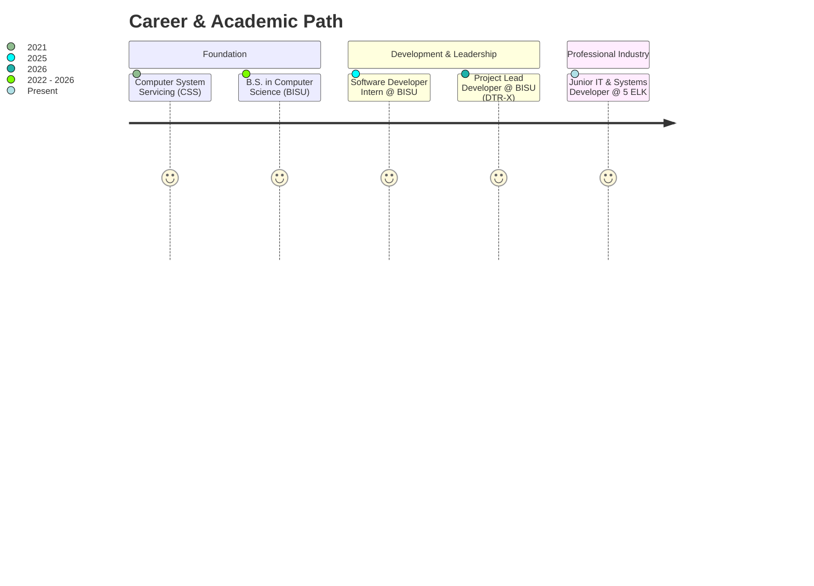

<div align="center">

<!-- HEADER BANNER & TYPING ANIMATION -->
<a href="https://romeoportfolio.vercel.app" target="_blank">
  
</a>

<p align="center">
  <b>Computer Science Graduate &bull; Bohol Island State University (BISU) &bull; Bohol, Philippines</b>
</p>

<!-- QUICK STATUS BADGES -->
<p align="center">
  <a href="https://romeoportfolio.vercel.app" target="_blank">
    
  </a>
  <a href="https://linkedin.com/in/romeopasilbas" target="_blank">
    
  </a>
  <a href="mailto:pasilbasromeo@gmail.com">
    
  </a>
  
</p>

---

</div>

<!-- ABOUT ME / TERMINAL VIEW -->
<details open>
<summary><b>👨‍💻 <code>miyu@developer:~$ whoami</code> (Click to toggle profile overview)</b></summary>
<br/>

```typescript
const profile: DeveloperProfile = {
  name: "Romeo C. Pasilbas Jr.",
  nickname: "Miyu",
  title: "CS Graduate | Fullstack Developer & IT Professional",
  education: "B.S. in Computer Science — Bohol Island State University (2026)",
  currentRole: "Junior IT & Systems Developer @ 5 ELK",
  honors: [
    "🏆 Presidential Award for Innovation (BISU)",
    "🏆 Programmer Recognition Award – DTRx System",
    "🏆 The Impact Award & The Exemplary Performance Award",
  ],
  focusAreas: [
    "Fullstack Web & Mobile Development",
    "IT Systems Troubleshooting & Infrastructure",
    "Database Architecture & API Integration",
    "AI/ML & Agentic Automation",
  ],
  currentlyExploring: ["Agentic Coding", "Workflow Automation", "Enterprise Networking"],
  location: "Bohol, Philippines 🇵🇭",
  availableFor: ["Fullstack Development", "Backend Development", "AI/ML Solutions", "IT & Helpdesk Support"]
};
```

> *"I am an aspiring IT professional and developer dedicated to crafting efficient, high-impact technology solutions, automating organizational workflows, and continuously pushing the boundaries of modern software engineering."*

</details>

<br/>

<!-- FEATURED PROJECT SPOTLIGHT: DTR-X -->
<div align="center">
  <h2>🚀 Featured Project Spotlight</h2>
</div>

<details open>
<summary><b>🌟 DTR-X (Daily Time Record Extended) — University HR & Time Tracking Enterprise System</b></summary>
<br/>

<div align="center">
  <a href="https://dtrx.bisubilar.org" target="_blank">
    
  </a>
  <br/><br/>
  
  <p>
    <a href="https://dtrx.bisubilar.org" target="_blank">
      
    </a>
    
    
    
  </p>
</div>

### 📌 System Overview & Impact
**DTR-X** is an enterprise-grade, university-wide web platform built for **Bohol Island State University (BISU)** that digitizes and automates Daily Time Record generation, attendance monitoring, and essential HR workflows. Accessible seamlessly across mobile and desktop environments.

- ⚡ **Automated DTR Generation**: Replaces manual time-log calculations with instant, error-free automated DTR processing.
- 📱 **Cross-Platform Accessibility**: Tailored for both high-density desktop administration and on-the-go mobile employee access.
- 👥 **Role-Based Workflow Management**: Dynamic permission matrix for faculty, administrative staff, supervisors, and HR personnel.
- 🏛️ **Multi-Campus Scaling**: Designed to support organizational needs across multiple university campuses.
- 🎖️ **Recognized with Honors**:
  - **Presidential Award for Innovation** from the Office of the University President.
  - **Programmer Recognition Award – DTRx System** from BISU Bilar Campus.

### 🛠️ Core Tech Stack
<p>
  
  
  
  
  
  
</p>

🔗 **Live Portal**: [dtrx.bisubilar.org](https://dtrx.bisubilar.org)

</details>

<br/>

---

<!-- INTERACTIVE SKILL MATRIX -->
<div align="center">
  <h2>🛠️ Technical Arsenal & Capabilities</h2>
</div>

<details open>
<summary><b>⚡ Interactive Tech Matrix (Click to expand / collapse categories)</b></summary>
<br/>

<table>
  <tr>
    <td width="22%" align="center"><b>Category</b></td>
    <td width="78%"><b>Technologies & Frameworks</b></td>
  </tr>
  <tr>
    <td align="center"><b>🎨 Frontend</b></td>
    <td>
      
      
      
      
      
      
      
      
      
    </td>
  </tr>
  <tr>
    <td align="center"><b>⚙️ Backend & APIs</b></td>
    <td>
      
      
      
      
      
      
      
      
      
    </td>
  </tr>
  <tr>
    <td align="center"><b>🗄️ Databases</b></td>
    <td>
      
      
      
      
      
      
    </td>
  </tr>
  <tr>
    <td align="center"><b>🤖 AI & Developer Tools</b></td>
    <td>
      
      
      
      
      
      
      
      
    </td>
  </tr>
  <tr>
    <td align="center"><b>🖥️ Systems & IT</b></td>
    <td>
      
      
      
      
    </td>
  </tr>
</table>

</details>

<br/>

<!-- EXPERIENCE & LEADERSHIP -->
<details>
<summary><b>💼 Professional Experience & Leadership Journey</b></summary>
<br/>



- **🏢 Junior IT & Systems Developer** | `5 ELK` *(Present)*
  - Providing technical infrastructure support, systems troubleshooting, and organizational software solutions.
- **🏛️ Project Lead Developer** | `Bohol Island State University` *(2026)*
  - Spearheaded development and deployment of **DTR-X**, revolutionizing time record automation across campus operations.
- **💻 Software Developer Intern** | `Bohol Island State University` *(2025)*
  - Developed institutional web systems and assisted in institutional digital transition initiatives.

</details>

<br/>

<!-- CERTIFICATIONS & HONORS -->
<details>
<summary><b>🏆 Honors, Awards & Industry Certifications</b></summary>
<br/>

- 🥇 **Presidential Award for Innovation** — *Office of the President, Bohol Island State University (June 2026)*
- 🌟 **Programmer Recognition Award – DTRx System** — *Bohol Island State University – Bilar Campus (May 2026)*
- 🏅 **The Impact Award** — *Bohol Island State University – Bilar Campus (May 2026)*
- 🏅 **The Exemplary Performance Award** — *Bohol Island State University – Bilar Campus (May 2026)*
- 🎓 **Google IT Support Professional Certificate** — *Google (May 2026)*
- 🤖 **Google AI Essentials Certificate** — *Google (Mar 2026)*
- 📜 **Research Presenter Award** — *1st ICBEIST (Apr 2025)*

</details>

<br/>

---

<!-- GITHUB REAL-TIME STATS -->
<div align="center">
  <h2>📊 GitHub Analytics & Activity</h2>

  <br/>
  
  <p align="center">
    <a href="https://github.com/romiyuuu">
      
    </a>
    <a href="https://github.com/romiyuuu">
      
    </a>
  </p>

  <p align="center">
    <a href="https://github.com/romiyuuu">
      
    </a>
  </p>
</div>

<br/>

---

<!-- GET IN TOUCH / INTERACTIVE FOOTER -->
<div align="center">
  <h2>📬 Let's Connect & Collaborate!</h2>
  <p>I'm always excited to discuss fullstack engineering, IT infrastructure, AI workflows, or new opportunities.</p>

  <a href="https://romeoportfolio.vercel.app" target="_blank">
    
  </a>
  &nbsp;
  <a href="mailto:pasilbasromeo@gmail.com">
    
  </a>
  &nbsp;
  <a href="https://linkedin.com/in/romeopasilbas" target="_blank">
    
  </a>
  &nbsp;
  <a href="https://wa.me/639852702055" target="_blank">
    
  </a>

  <br/><br/>
  
  <p align="center">
    <sub>Crafted with passion by <b>Romeo C. Pasilbas Jr. (Miyu)</b> &bull; © 2026</sub>
  </p>
</div>
